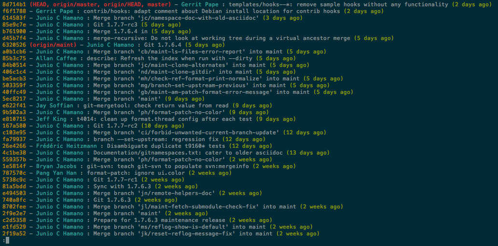
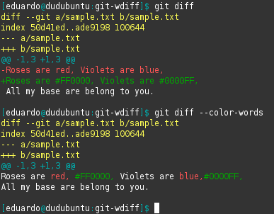
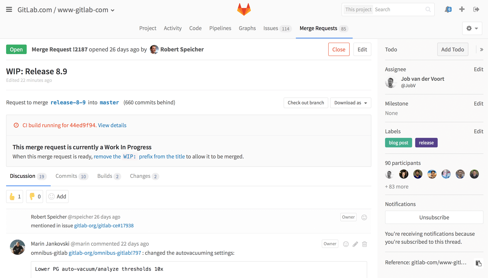

% Le déploiement manuel : non merci, j'essaie d'arrêter !
% David Sferruzza
% 30/09/2016


# À propos de moi

- [\@d_sferruzza](https://twitter.com/d\_sferruzza)
- [github.com/dsferruzza](https://github.com/dsferruzza)
- Responsable R&D chez [Startup Palace](http://www.startup-palace.com)
- Doctorant en génie logiciel à l'Université de Nantes

<figure class="stretch"></figure>


# Startup Palace

Nous concevons et développons des applications web.
<br><small>(parmi d'autres activités)</small>

Nous aidons des startups à proposer de la valeur à leurs marchés : la **qualité** des applications est importante.

On veut éviter un *facteur bus* trop faible.

<figure class="stretch"></figure>


# Startup Palace

Le développement, la qualité et le déploiement d'un projet ne doivent **pas** reposer sur une seule personne !

> Il faut **documenter** et **automatiser** un maximum de choses pour pouvoir travailler collaborativement.

<figure class="stretch"></figure>


# Mais revenons un peu en arrière...

&nbsp;

<figure class="stretch"></figure>

... quand il n'y avait qu'un seul développeur.


# Collaboration unipersonnelle

La source de vérité du projet est sur le poste du dev.

Le dev gère tout manuellement :

- écriture du code
- dépendances externes
- construction de l'application
- déploiement de l'application

<figure class="stretch"></figure>


# Écriture du code

On prend l'exemple d'un site développé avec Jekyll.

> 
>
> Transform your plain text into static websites and blogs.
>
> <https://jekyllrb.com/>


# Écriture du code

Le dev est seul.
Il n'a pas besoin de partager son code ou d'y incorporer des modifications faites par d'autres.

<div class="smallcode">
```text
.
├── _config.yml
├── _drafts
|   ├── begin-with-the-crazy-ideas.md
|   └── on-simplicity-in-technology.md
├── _includes
|   ├── footer.html
|   └── header.html
├── _layouts
|   ├── default.html
|   └── post.html
├── _posts
|   ├── 2007-10-29-why-every-programmer-should-play-nethack.md
|   └── 2009-04-26-barcamp-boston-4-roundup.md
├── _data
|   └── members.yml
├── _site
├── .jekyll-metadata
└── index.html
```
</div>


# Dépendances externes

Le projet a besoin de [jQuery](https://jquery.com/) pour fonctionner.

Le dev va donc :

- télécharger le fichier `jquery-3.1.1.min.js` depuis le site officiel
- le placer dans l'arborescence du projet Jekyll

S'il veut mettre à jour jQuery, il supprime l'ancienne version et recommence.

<figure class="stretch"></figure>


# Construction de l'application

Le dev a installé sur son système :

- Ruby
- Jekyll

Il lance une commande pour produire le site final :
<br>`bundle exec jekyll build`

Le dossier `_site/` contient maintenant une version déployable de l'application.

<figure class="stretch"></figure>


# Déploiement de l'application

Le dev envoie le contenu du dossier `_site/` vers son hébergement.

Il peut utiliser (notamment) :

- FTP
- SFTP
- rsync

<figure class="stretch"></figure>


# Le temps passe...

Plus de projets &rarr; plus de devs

&nbsp;

<figure class="stretch"></figure>

&nbsp;

Les devs doivent collaborer sur les projets, ce qui pose des problèmes.


# Problèmes de collaboration

Quelques exemples :

- le code source ne peut **pas** être sur le poste d'un seul dev, la source de vérité non plus
- il faut pouvoir travailler à plusieurs *simultanément* sur le même projet
- tous les devs doivent être capable de :
	- **construire** l'application (avec une recette *identique*)
	- la **tester** (dans un environnement *identique*)
	- la **déployer**


# Version Control System

Ou *VCS*, *logiciel de gestion de versions*.

> Permet de stocker un ensemble de fichiers en conservant la chronologie de toutes les modifications qui ont été effectuées dessus.

On code normalement, et on utilise le *VCS* pour organiser la journalisation de nos modifications.

Aujourd'hui, on ne va parler que de [Git](https://git-scm.com/).
<br>(mais il y en a d'autres)


# Git

<figure class="stretch"></figure>


# Git

<figure class="stretch"></figure>


# Git

<figure class="stretch"></figure>


# Avantages de Git

On peut :

- bosser à plusieurs sur les mêmes fichiers *simultanément*
- garder trace de *chaque* changement
- naviguer dans l'historique
- bosser sur plusieurs versions du projet *en parallèle* (anciennes versions, fonctionnalités expérimentales, ...)

> Apprenez Git.
> Utilisez Git.

Utilisez une **interface graphique** pour débuter.
<br>Exemple : [GitHub Desktop](https://desktop.github.com/)


# GitLab

<figure class="stretch"></figure>

> [GitLab](https://about.gitlab.com/) unifies chat, issues, code review,<br>CI and CD into a single UI


# GitLab

<figure class="stretch"></figure>


# Bilan

- le code source ne peut **pas** être sur le poste d'un seul dev, la source de vérité non plus

> **&check;**&nbsp; La source de vérité est le dépôt Git dans GitLab.

- il faut pouvoir travailler à plusieurs *simultanément* sur le même projet

> **&check;**&nbsp; Git permet ça, et GitLab ajoute du confort !


# Problème

Inclure jQuery dans la base de code rend :

- les *diff* peu lisibles
- les *merge* conflictuelles

jQuery est une dépendance **externe** : on n'a pas envie de la gérer comme le reste du code qu'on écrit !

<figure class="stretch"></figure>


# npm

> [npm](https://www.npmjs.com/) est le gestionnaire de paquets officiel de Node.js.

On synchronise dans Git un *manifeste* qui contient des **références** vers les dépendances.

Sur chaque poste de dev, on lance `npm install` pour récupérer ces dépendances et les placer dans le dossier `node_modules/`.

<figure class="stretch"></figure>


# npm

`package.json` :

```json
{
  "name": "my-awesome-package",
  "version": "1.0.0",
  "dependencies": {
    "jquery": "3.1.1"
  }
}
```

`.gitignore` :

```text
/node_modules/
```


# Bilan

- les dépendances externes sont synchronisées avec le reste du code

> **&check;**&nbsp; On ne synchronise que des références, et on a un outil pour les résoudre et récupérer le contenu des dépendances.


# Grunt

<figure class="stretch"></figure>

> [Grunt](http://gruntjs.com/) est un outil permettant de définir et lancer des tâches automatisées.

On définit les tâches dans le fichier `Gruntfile.js` et on utilise la commande `grunt [tâche]` pour les lancer.


# Grunt

Exemple : on veut *minifier* le JavaScript de notre application.

<div class="smallcode">
```javascript
module.exports = function(grunt) {

  grunt.initConfig({
    pkg: grunt.file.readJSON('package.json'),
    uglify: {
      build: {
        src: 'src/app.js',
        dest: 'build/app.min.js'
      }
    }
  });

  grunt.loadNpmTasks('grunt-contrib-uglify');

  grunt.registerTask('default', ['uglify']);

};
```
</div>

`src/app.js` + Grunt &rarr; `build/app.min.js`


# Problème

Si on synchronise `build/app.min.js` :

- on duplique pas mal d'informations (venant de `src/app.js`)
- les *merge* sont beaucoup plus difficiles à gérer
- les *diff* comportent des informations inutiles

Si on ne le synchronise pas :

- il faut penser à le générer quand `src/app.js` est modifié
- il faut pour ça avoir les bonnes dépendances et un environnement propre


# README

On ajoute `/build/app.min.js` dans `.gitignore`.

On n'est pas des animaux. On ajoute un fichier `README` qui documente :

- les outils requis
- comment installer les dépendances externes
- comment construire le fichier `/build/app.min.js`

<figure class="stretch"></figure>


# Problèmes potentiels

- on n'a pas vu que le README a changé
- on n'a pas vu que les versions des dépendances ont changé dans `package.json`
- la procédure est cassée lorsqu'on la suit sur un environnement propre
- l'application qui ira en production est produite sur la machine d'un des devs
- ...

<figure class="stretch"></figure>
