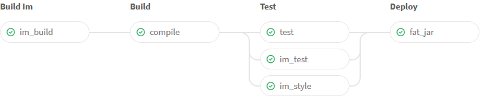

% Le déploiement manuel : non merci, j'essaie d'arrêter !
% David Sferruzza
% 30/09/2016


# À propos de moi

- [\@d_sferruzza](https://twitter.com/d\_sferruzza)
- [github.com/dsferruzza](https://github.com/dsferruzza)
- Responsable R&D chez [Startup Palace](http://www.startup-palace.com)
- Doctorant en génie logiciel à l'Université de Nantes

<figure class="stretch"></figure>


# Startup Palace

Nous concevons et développons des applications web.
<br><small>(parmi d'autres activités)</small>

Nous aidons des startups à proposer de la valeur à leurs marchés : la **qualité** des applications est importante.

On veut éviter un *facteur bus* trop faible.

<figure class="stretch"></figure>


# Startup Palace

Le développement, la qualité et le déploiement d'un projet ne doivent **pas** reposer sur une seule personne !

> Il faut **documenter** et **automatiser** un maximum de choses pour pouvoir travailler collaborativement.

<figure class="stretch"></figure>


# Mais revenons un peu en arrière...

&nbsp;

<figure class="stretch"></figure>

... quand il n'y avait qu'un seul développeur.


# Collaboration unipersonnelle

La source de vérité du projet est sur le poste du dev.

Le dev gère tout manuellement :

- écriture du code
- dépendances externes
- construction de l'application
- déploiement de l'application

<figure class="stretch"></figure>


# Écriture du code

On prend l'exemple d'un site développé avec Jekyll.

> 
>
> Transform your plain text into static websites and blogs.
>
> <https://jekyllrb.com/>


# Écriture du code

Le dev est seul.
Il n'a pas besoin de partager son code ou d'y incorporer des modifications faites par d'autres.

<div class="smallcode">
```text
.
├── _config.yml
├── _drafts
|   ├── begin-with-the-crazy-ideas.md
|   └── on-simplicity-in-technology.md
├── _includes
|   ├── footer.html
|   └── header.html
├── _layouts
|   ├── default.html
|   └── post.html
├── _posts
|   ├── 2007-10-29-why-every-programmer-should-play-nethack.md
|   └── 2009-04-26-barcamp-boston-4-roundup.md
├── _data
|   └── members.yml
├── _site
├── .jekyll-metadata
└── index.html
```
</div>


# Dépendances externes

Le projet a besoin de [jQuery](https://jquery.com/) pour fonctionner.

Le dev va donc :

- télécharger le fichier `jquery-3.1.1.min.js` depuis le site officiel
- le placer dans l'arborescence du projet Jekyll

S'il veut mettre à jour jQuery, il supprime l'ancienne version et recommence.

<figure class="stretch"></figure>


# Construction de l'application

Le dev a installé sur son système :

- Ruby
- Jekyll

Il lance une commande pour produire le site final :
<br>`bundle exec jekyll build`

Le dossier `_site/` contient maintenant une version déployable de l'application.

<figure class="stretch"></figure>


# Déploiement de l'application

Le dev envoie le contenu du dossier `_site/` vers son hébergement.

Il peut utiliser (notamment) :

- FTP (bof)
- SFTP
- rsync

<figure class="stretch"></figure>


# Le temps passe...

Plus de projets &rarr; plus de devs

&nbsp;

<figure class="stretch"></figure>

&nbsp;

Les devs doivent collaborer sur les projets, ce qui pose des problèmes.


# Problèmes de collaboration

Quelques exemples :

- le code source ne peut **pas** être sur le poste d'un seul dev, la source de vérité non plus
- il faut pouvoir travailler à plusieurs *simultanément* sur le même projet
- tous les devs doivent être capable de :
	- **construire** l'application (avec une recette *identique*)
	- la **tester** (dans un environnement *identique*)
	- la **déployer**

<div class="notes">
chaises Ikea
</div>


# Version Control System

Ou *VCS*, *logiciel de gestion de versions*.

> Permet de stocker un ensemble de fichiers en conservant la chronologie de toutes les modifications qui ont été effectuées dessus.

On code normalement, et on utilise le *VCS* pour organiser la journalisation de nos modifications.

Aujourd'hui, on ne va parler que de [Git](https://git-scm.com/).
<br>(mais il y en a d'autres)


# Git

<figure class="stretch"></figure>


# Git

<figure class="stretch"></figure>


# Git

<figure class="stretch"></figure>


# Avantages de Git

On peut :

- bosser à plusieurs sur les mêmes fichiers *simultanément*
- garder trace de *chaque* changement
- naviguer dans l'historique
- bosser sur plusieurs versions du projet *en parallèle* (anciennes versions, fonctionnalités expérimentales, ...)

> Apprenez Git.
> Utilisez Git.

Utilisez une **interface graphique** pour débuter.
<br>Exemple : [GitHub Desktop](https://desktop.github.com/) (Windows/Mac OS)


# GitLab

<figure class="stretch"></figure>

> [GitLab](https://about.gitlab.com/) unifies chat, issues, code review,<br>CI and CD into a single UI

<div class="notes">
forge logicielle
</div>


# GitLab

<figure class="stretch"></figure>

<div class="notes">
- permet plein de workflows
- master toujours stable
</div>


# Bilan

- le code source ne peut **pas** être sur le poste d'un seul dev, la source de vérité non plus

> **&check;**&nbsp; La source de vérité est le dépôt Git dans GitLab.

- il faut pouvoir travailler à plusieurs *simultanément* sur le même projet

> **&check;**&nbsp; Git permet ça, et GitLab ajoute du confort !


# Problème

Inclure jQuery dans la base de code rend :

- les *diff* peu lisibles
- les *merge* conflictuelles

jQuery est une dépendance **externe** : on n'a pas envie de la gérer comme le reste du code qu'on écrit !

<figure class="stretch"></figure>


# npm

> [npm](https://www.npmjs.com/) est le gestionnaire de paquets officiel de Node.js.

On synchronise dans Git un *manifeste* qui contient des **références** vers les dépendances.

Sur chaque poste de dev, on lance `npm install` pour récupérer ces dépendances et les placer dans le dossier `node_modules/`.

<figure class="stretch"></figure>


# npm

`package.json` :

```json
{
  "name": "my-awesome-project",
  "version": "1.0.0",
  "dependencies": {
    "jquery": "3.1.1"
  }
}
```

`.gitignore` :

```text
/node_modules/
```


# Bilan

- les dépendances externes sont synchronisées avec le reste du code

> **&check;**&nbsp; On ne synchronise que des références, et on a un outil pour les résoudre et récupérer le contenu des dépendances.

<div class="notes">
- MAJ des deps &rarr; commit
- reproductible
</div>


# Grunt

<figure class="stretch"></figure>

> [Grunt](http://gruntjs.com/) est un outil permettant de définir et lancer des tâches automatisées.

On définit les tâches dans le fichier `Gruntfile.js` et on utilise la commande `grunt [tâche]` pour les lancer.


# Grunt

Exemple : on veut *minifier* le JavaScript de notre application.

<div class="smallcode">
```javascript
module.exports = function(grunt) {

  grunt.initConfig({
    pkg: grunt.file.readJSON('package.json'),
    uglify: {
      build: {
        src: 'src/app.js',
        dest: 'build/app.min.js'
      }
    }
  });

  grunt.loadNpmTasks('grunt-contrib-uglify');

  grunt.registerTask('default', ['uglify']);

};
```
</div>

`src/app.js` + Grunt &rarr; `build/app.min.js`

<div class="notes">
avantages par rapport à CLI :

- écosystème Node
- deps dans npm
- ~ portable
</div>


# Problème

Si on synchronise `build/app.min.js` :

- on duplique pas mal d'informations (venant de `src/app.js`)
- les *diff* comportent des informations inutiles
- les *merge* sont beaucoup plus difficiles à gérer

Si on ne le synchronise pas :

- il faut penser à le générer quand `src/app.js` est modifié
- il faut pour ça avoir les bonnes dépendances et un environnement propre


# README

On ajoute `/build/app.min.js` dans `.gitignore`.

On n'est pas des animaux, on ajoute un fichier `README` qui documente :

- les outils requis
- comment installer les dépendances externes
- comment construire le fichier `/build/app.min.js`

<figure class="stretch"></figure>


# Problèmes potentiels

- on n'a pas vu que le README a changé
- on n'a pas vu que les versions des dépendances ont changé dans `package.json`
- la procédure est cassée lorsqu'on la suit sur un environnement propre
- l'application qui ira en production est produite sur la machine d'un des devs
- ...

<figure class="stretch"></figure>

<div class="notes">
interprété par des **humains**
</div>


# CI/CD

*Continuous Integration* & *Continuous Delivery*

> CI = vérifier à **chaque** modification de code source que le résultat des modifications ne produit pas de régression.

Usages courants :

- vérifier qu'on peut **construire et installer** l'app
- vérifier que les **tests automatisés** passent avec succès
- **déployer** l'app en (pré)production

<div class="notes">
- Artifacts
- Éviter les problèmes de dernière minute
- Tests par un tier neutre
</div>


# GitLab CI

1. Ajouter un fichier `.gitlab-ci.yml` au projet
2. C'est tout !

<figure class="stretch"></figure>

```yaml
lint:
  stage: test
  script:
    - npm install --quiet
    - npm run lint
```

# Docker

> Docker est un outil qui peut empaqueter une application et ses dépendances dans un conteneur isolé, qui pourra être exécuté sur n'importe quel serveur Linux.

On peut facilement créer une image Docker qui contient tous nos outils préférés.

<div class="smallcode">
```dockerfile
FROM debian:jessie
RUN curl -sL https://deb.nodesource.com/setup_6.x | sudo -E bash -
RUN apt-get update \
 && apt-get install --no-install-recommends -y \
    nodejs
```
</div>


# GitLab CI

Chaque tâche de GitLab CI peut être lancée dans une image Docker : on maitrise l'environnement d'exécution.

```yaml
lint:
  stage: test
  image: myorg/myimage:latest
  script:
    - npm install --quiet
    - npm run lint
  tags:
    - docker
```

Une fois que c'est terminé, on récupère le résultat et on jette le container à la poubelle !


# GitLab CI

Autres avantages :

- intégré à GitLab (UI, notifications, MR, ...)
- tâches en séquence **et** en parallèle
- suivi du log du *build* en temps réel
- extraction des fichiers produits dans une archive

<figure class="stretch"></figure>


# GitLab CI

<figure class="stretch"></figure>


# Bilan

- tous les devs doivent être capable de :
	- **construire** l'application (avec une recette *identique*)
	- la **tester** (dans un environnement *identique*)

> **&check;**&nbsp; On utilise GitLab CI pour lancer la construction et les tests dans une image Docker.


# Déploiement automatisé (CD)

On peut choisir d'exécuter certaines tâches uniquement dans certains cas :

```yaml
deploy_prod:
  stage: deploy
  image: myorg/myimage:latest
  script:
    - npm install --quiet
    - npm run lint
    - # deploy command
  tags:
    - docker
  only:
    - tags
```


# Variables

<figure class="stretch"></figure>

<div class="smallcode">
```yaml
some_task:
  script:
    - echo "$TEST"
```
</div>


# rsync/lftp

> Transférer en une commande un dossier local vers un serveur distant.

- rsync : utilise SSH + protocole maison
- lftp : utilise FTP

Exemple (non-optimal) :

<div class="smallcode">
```bash
rsync -r ./ "$USER:$PASSWORD@$HOST:/var/www/$CI_PROJECT_NAME"
```
</div>

**Problème** : le site en production peut être *entre* 2 états (ancienne version et nouvelle version).


# Deployer

> [Deployer](http://deployer.org/) permet des déploiements **atomiques**.

<div class="smallcode">
```text
/your/project/path
|--releases
|  |--20150513120631
|--shared
|  |--config.php
|  |--...
|--current -> /your/project/path/releases/20150513120631
```
</div>

On définit les tâches de déploiement dans le fichier `deploy.php` et on utilise la commande `php deployer.phar [tâche]` pour les lancer.


# Deployer

`deploy.php` :

<div class="smallcode">
```php
<?php

require 'recipe/common.php';

task('deploy:upload_code', function () {
    upload('build', '{{release_path}}/');
})->desc('Uploading code');

task('deploy', [
    'deploy:prepare',
    'deploy:release',
    'deploy:upload_code',
    'deploy:symlink',
    'cleanup',
])->desc('Deploy your project');

server('prod', getenv('PROD_HOST'))
    ->user(getenv('PROD_USERNAME'))
    ->password(getenv('PROD_PASSWORD'))
    ->env('deploy_path', '~')
    ->stage('production');

set('default_stage', 'production');
```
</div>


# Bonus : artifacts & dependencies

<figure class="stretch"></figure>

<div class="smallcode">
```yaml
compile:
  stage: build
  dependencies:
    - im_build
  script:
    - ...
  artifacts:
    name: "$CI_BUILD_NAME-$CI_BUILD_REF"
    paths:
      - target/
    expire_in: 1 day
  tags:
    - docker
```
</div>


# Bilan

- tous les devs doivent être capable de déployer l'application :

> **&check;**&nbsp; On utilise GitLab CI + Deployer pour déployer automatiquement lorsqu'on crée un tag.

<figure class="stretch"></figure>


# Bonus : gestion des environnements de préprod

<figure class="stretch"></figure>

> The Purely Functional Linux Distribution
>
> <https://nixos.org>

<https://dsferruzza.github.io/conf-immutable-infrastructure-with-nixos>


# Conclusion

> **Utilisez Git !**

<figure class="stretch"></figure>

Et mettez en place un CI/CD sur votre projet :)


# Questions ?

<figure class="stretch"></figure>

Twitter : [\@d_sferruzza](https://twitter.com/d\_sferruzza)

Slides sur GitHub :

[dsferruzza/conf-arreter-deploiement-manuel](http://github.com/dsferruzza/conf-arreter-deploiement-manuel)
